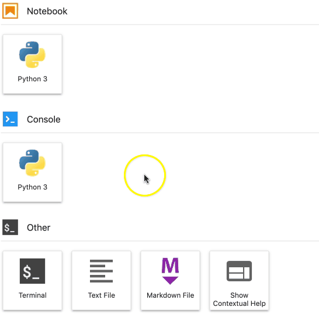
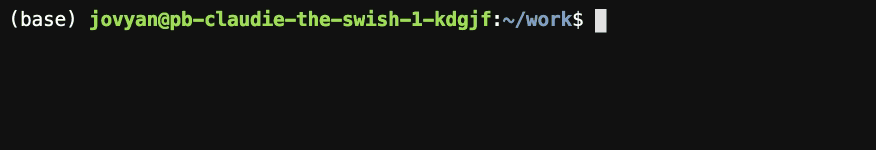
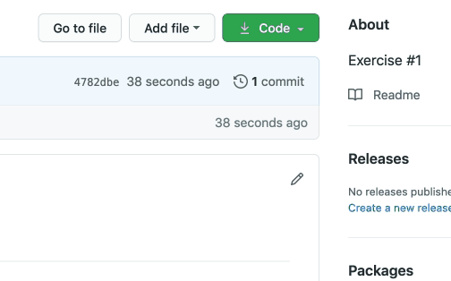
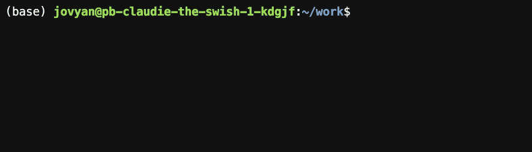

.. _github_pull:

Retrieve learning materials from GitHub
=======================================
.. raw:: html

   <iframe width="560" height="315" src="https://www.youtube.com/embed/uukaUqOLRr4" frameborder="0" allow="accelerometer; autoplay; clipboard-write; encrypted-media; gyroscope; picture-in-picture" allowfullscreen></iframe>

The learning materials for this course are hosted on `GitHub <https://www.github.com>`_. 

.. note::

   GitHub is a service that allows hosting code for programs and various other file types, which are organised into *repositories*. The name of the service alludes to the underlying program, `Git <https://en.wikipedia.org/wiki/Git>`_, which keeps track of any modifications to the files and retains a history of changes made to previous versions of the file. Git is responsible for *version control*: GitHub enables multiple people to collaborate on the same repository, while Git keeps track of the changes made.

To the retrieve learning materials from GitHub, navigate to :ref:`the main view in JupyterLab <jupyterlab>` and follow the instructions below.

Click the Terminal button to launch a terminal.

Terminal opens a command line interface. We will use the command line interface to establish a connection to GitHub.

Navigate to the repository on GitHub in another browser window and copy the address of the repository from the top-right hand corner.

Change back to Terminal in JupyterLab and type the following command:

.. code-block:: console

   git clone <address of the GitHub repository>

You can paste the address of the GitHub repository into the command line by pressing the `Control` and `v` keys at the same time. Then press ⏎ to execute the command. 

Cloning the repository creates a local copy of the repository on your server. 

You should now see a directory named after the repository in the *File Browser* on the left-hand side of the main view in JupyterLab.

.. important::

   Cloning a repository establishes a connection between the local repository on your server and the remote repository on GitHub.

   To incorporate any changes to the remote repository to your local repository, you do not need to clone the repository again. You can use the command :code:`git pull` to apply the changes to your local repository.

The video below shows some basic tips for using the learning materials in Jupyter Notebooks.

.. raw:: html

   <iframe width="560" height="315" src="https://www.youtube.com/embed/JA8eXq2O2tc" frameborder="0" allow="accelerometer; autoplay; clipboard-write; encrypted-media; gyroscope; picture-in-picture" allowfullscreen></iframe>

When you have the learning materials, you can proceed to :ref:`retrieve and complete the exercises <tmc_usage>`.