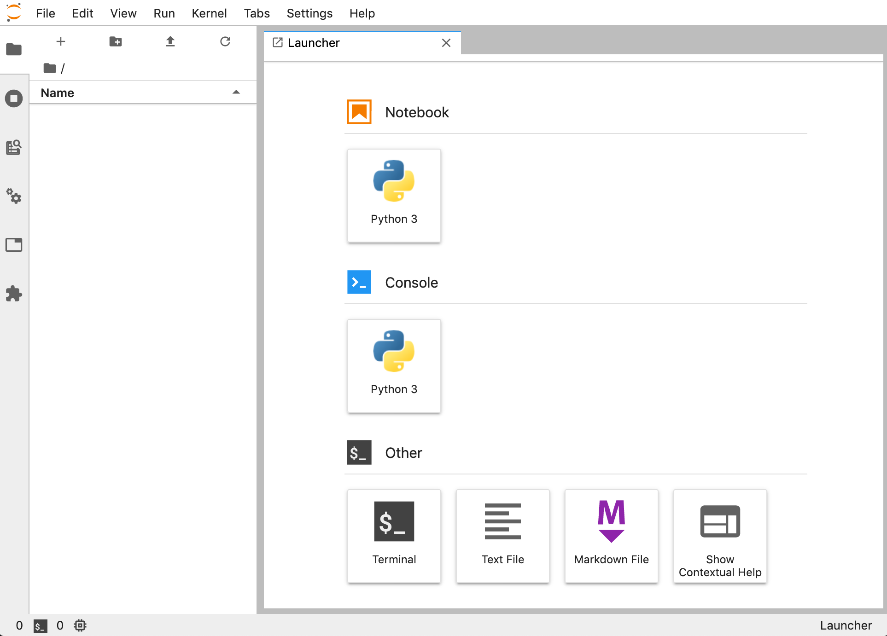

Working in JupyterLab
=====================

The main view of JupyterLab has two major elements: *File Browser* (left) and *Launcher* (right).

|

|

The video below provides a brief overview of JupyterLab and its functionalities.

|

.. youtube:: -UwAsLtl8nQ

|

To get started with the course, you must `retrieve learning materials and exercises from GitHub <github_pull.rst>`_.