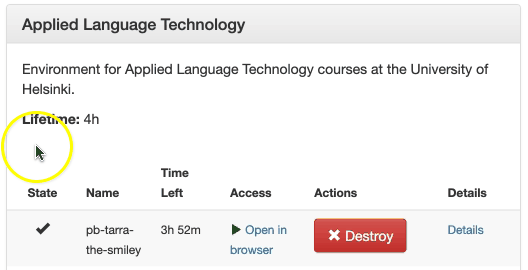
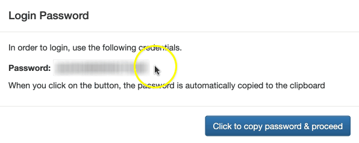
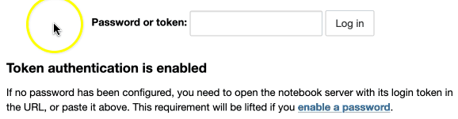

.. _CSCNotebooksServer:

********************************
Launch a server on CSC Notebooks
********************************

Follow the instructions below to launch a server with the course environment on CSC Notebooks.

Click the *Launch new* button once to launch your personal server on CSC Notebooks.

   .. image:: ../img/csc_nb_launch_env.gif
      :width: 400
      :alt: Click the "Launch new" button.

When the server has been launched successfully, you will see a link in the *Access* column. 

Click the *Open in browser* link.

This opens a window with a password, which is automatically copied on your clipboard.
   
Click the *Click to copy password & proceed* button.

This opens a new window with a password prompt.
 
Paste the password on the clipboard into the box by pressing *Control* and *v* at the same time. Then click the *Log in* button. 

Upon successful login, the server opens :ref:`JupyterLab <jupyterlab>`, an interactive programming environment running on the server.