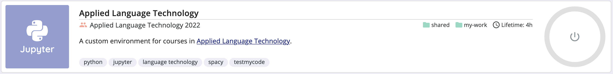

.. _CSCNotebooksServer:

********************************
Launch a server on CSC Notebooks
********************************

Follow the instructions below to launch a server on CSC Notebooks.

Click the *"Power on"* button on the right-hand side to launch a server on CSC Notebooks.

This will start the server, which opens in another browser window. The server will open into :ref:`JupyterLab <jupyterlab>`, an interactive programming environment.

.. warning::

   Your browser might block the pop-up window. Please allow pop-ups for CSC Notebooks or follow the instructions below.

If you cannot see the window, click the link symbol in the upper part of the *"Power on"* button to launch the server.

.. image:: ../img/csc_nb_course_env_launch.png
   :width: 100%
   :alt: Click the upper part of the "Power on" button on the right.

When you are done, click the lower part of the *"Power on"* button to shut down the server. This will save computational and natural resources. 🍃 

