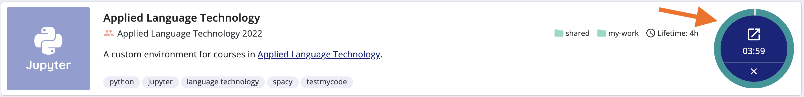

.. _CSCNotebooksServer:

********************************
Launch a server on CSC Notebooks
********************************

Follow the instructions below to launch a server on CSC Notebooks.

Click the *"Power on"* button on the right to launch a server on CSC Notebooks.

.. image:: ../img/csc_nb_course_env.png
   :width: 100%
   :alt: Click the "Power on" button on the right.

This will start the server in another pop-up browser window.

If you cannot see the window, click the upper part of the *Power on* button to launch the server.

The server opens :ref:`JupyterLab <jupyterlab>`, an interactive programming environment running on the server.

When you are done with your work, please click the lower part of the *Power on* button to shut down the server. This will save computational resources. 🍃 