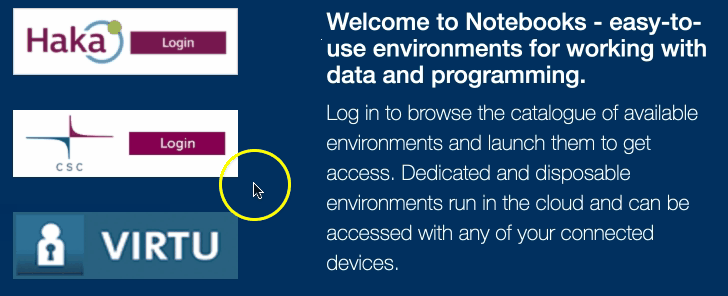
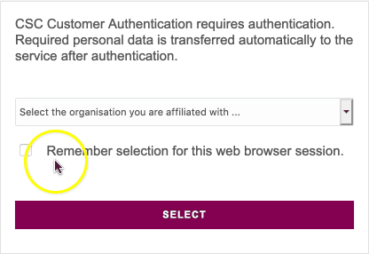
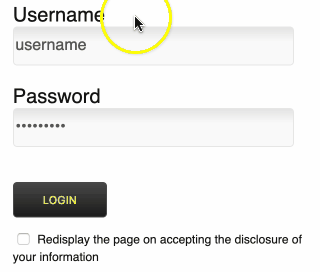

.. _CSCNotebooks:

***********************
Log in to CSC Notebooks
***********************

CSC Notebooks is a service provided by `CSC – IT Centre for Science <https://www.csc.fi>`_, a company jointly owned by the Finnish state and universities.

The CSC Notebooks platform allows users to run their own virtual servers, also called *instances*, on CSC computers.

To access the platform, open a web browser on your computer and navigate to `CSC Notebooks <https://notebooks-beta.rahtiapp.fi//>`_.

Next, click the green *Login* button. You will be redirected to the login page.

   
Choose **Haka** as your login method.

Choose your university from the drop-down menu and click **Select**.

Enter your *university username and password* and click **Login**.

If prompted, click **Accept** to forward your login to CSC Notebooks. 

If the login was successful, you should see the environments available on CSC Notebooks, including an environment named Applied Language Technology.

.. image:: ../img/csc_nb_course_env.png
   :width: 100%
   :alt: Environment for courses in Applied Language Technology.

.. warning::

   If you cannot find an environment named *Applied Language Technology* on the landing page, you have not joined the course workspace on CSC Notebooks.

   To join the group, complete the following steps.

   1. Click the *Join workspace* button on the upper right corner of the page.

   2. Enter the code you received from the course organiser and press the *+* button.

   You only need to complete these steps once. 

   The next time you log in on CSC Notebooks, you should see the course environment among the available environments.

You are now ready to :ref:`launch the course environment <CSCNotebooksServer>`.