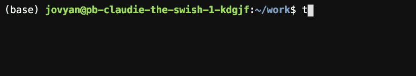

.. _tmc_usage:

*************************************
Check your exercises using TestMyCode
*************************************

What is TestMyCode (TMC)?
=========================

`TestMyCode <https://testmycode.github.io/>`_ (or TMC for short) is a tool that enables you to submit your Python code for automatic grading.

TMC has a command line interface, which may be accessed through the Terminal application in JupyterLab, as instructed in the :ref:`previous section <jupyterlab>`.

To get started with TMC, follow the instructions below.

Logging in to TMC
=================

To use TMC, you need to first register as a user on the `mooc.fi <https://mooc.fi>`_ website.

Next, open a new Terminal from the :ref:`JupyterLab Launcher <jupyterlab>` to access the command line interface.

.. image:: ../img/jl_launch_terminal.gif
  :width: 50%
  :alt: A view of JupyterLab.

.. raw:: html

    

.. image:: _static/empty.png

To log in to TMC, type the command :code:`tmc login` on the command line and press ⏎ to execute the command.

.. raw:: html

    

.. image:: _static/empty.png

TMC will prompt you for your e-mail address or username.

Enter the e-mail or username that you registered on the `mooc.fi <https://mooc.fi>`_ website and press ⏎.

.. image:: ../img/tmc_username.gif
  :width: 75%
  :alt: A view of the TMC command line interface.

.. raw:: html

    

.. image:: _static/empty.png

Next, type in your password for the `mooc.fi <https://mooc.fi>`_ platform and press ⏎.

.. important::

   The cursor will not move when you type into the password prompt, but your password is still being entered.

.. raw:: html

    

.. image:: _static/empty.png

If the login is successful, TMC will prompt you to select an organization. 

.. image:: ../img/tmc_done.gif
  :width: 75%
  :alt: A view of the TMC command line interface.

.. raw:: html

    

.. image:: _static/empty.png

Use the arrow keys ↑↓ to navigate the list and choose :code:`MOOC`. Press ⏎ to confirm your selection.

Next, TMC will prompt you to select a course. 

Again, use the arrow keys ↑↓ to navigate the list and choose :code:`Applied Language Technology`. Press ⏎ to confirm your selection.

This downloads the exercises into a directory named :code:`mooc-applied-lt-2022`, which should be visible in the :ref:`JupyterLab File Browser <jupyterlab>`.

.. _tmc_dl:

Downloading and updating exercises using TMC
============================================

TMC will automatically download any missing exercises on your server when you log into the system.

To download exercises manually, open a Terminal and type the command :code:`tmc download` and press ⏎.

TMC will prompt you to select a course.

Use the arrow keys ↑↓ to navigate to :code:`Applied Language Technology` and press ⏎ to confirm your selection.

.. image:: ../img/tmc_dl.gif
  :width: 75%
  :alt: A view of the TMC command line interface.

.. raw:: html

    

.. image:: _static/empty.png

This will download all available exercises into the directory :code:`mooc-applied-lt-2022` in your home directory.

If instructed to do so, you can also update the exercises by typing :code:`tmc update` and  pressing ⏎.

.. raw:: html

    

.. image:: _static/empty.png

This will update all exercises available to you.

.. _tmc_test:
  
Testing your code locally using TMC
===================================

After completing an exercise in a Jupyter Notebook, you can test your code by following the steps below.

In this context, *testing* refers to evaluating whether the Python code you wrote produces the expected output.

To get started, save the Jupyter Notebook by entering the *File* menu and selecting *Save Notebook*, or click the save icon at the top of the Notebook.

Next, close the Jupyter Notebook.

Open a new Terminal from the :ref:`JupyterLab Launcher <jupyterlab>` to access the command line interface.

To test your code, type the command :code:`tmc test` and press ⏎.

.. image:: ../img/tmc_test.gif
  :width: 75%
  :alt: A view of the TMC command line interface.

.. raw:: html

    

.. image:: _static/empty.png

TMC will prompt you to select a course.

Use the arrow keys ↑↓ to navigate to :code:`mooc-applied-lt-2022` and press ⏎ to confirm your selection.

Next, TMC will prompt you to select an exercise to test.

Use the arrow keys ↑↓ to navigate the list, select the exercise you want to test and press ⏎.

TMC evaluates your solutions to the exercise and prints out the result, which includes the points given for the exercise.

Open the Jupyter Notebook that contains the exercise to see feedback on your code.

.. tip::

   Instead of closing the Jupyter Notebook, you can simply save the Notebook, run the command :code:`tmc test` in a Terminal and hit the reload button on your browser to see the feedback written to the Notebook. 

   Unfortunately, JupyterLab does not automatically refresh Notebooks that have been modified. This also applies to TMC, which modifies the Notebook when adding feedback.

Remember to :ref:`submit your code to the TMC server <tmc_submit>` when you are done with an exercise to register any points.
 
.. _tmc_submit:

Submitting your code to the TMC server
======================================

When you are finished with an exercise, you must submit your code to the TMC server for final grading. This will also register your points for the exercise.

.. tip::

   You can submit your code to the TMC server even if it does not pass :ref:`all local tests <tmc_test>`.

To submit your code to the TMC server, open a Terminal and type the command :code:`tmc submit` and press ⏎.

.. image:: ../img/tmc_submit.gif
   :width: 75%
   :alt: A view of the TMC command line interface.

.. raw:: html

    

.. image:: _static/empty.png

Use the arrow keys ↑↓ to navigate to :code:`mooc-applied-lt-2022` and press ⏎ to confirm your selection.

Next, TMC will prompt you to select an exercise to submit.

Use the arrow keys ↑↓ to navigate the list, select the exercise you want to submit and press ⏎.

The server will run the tests and return information on any points awarded for the submission.

.. important::

   All points are awarded permanently. Even if you submit a solution that fails afterwards, points will not be deducted.

You can monitor your overall progress by visiting `mooc.fi <https://mooc.fi>`_ and viewing your profile information.

To view your profile, click your e-mail address / username in the top right-hand corner.
